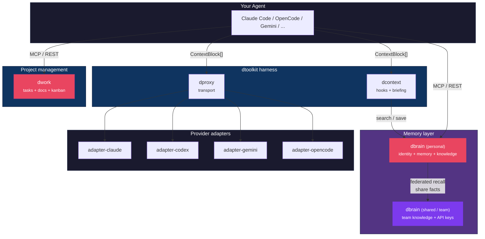

<p align="center">
  
</p>

<h1 align="center">dtoolkit</h1>
<p align="center">Open-source harness engineering toolkit for AI coding agents</p>

<p align="center">
  <a href="LICENSE"></a>
  <a href="https://github.com/ivncmp/dtoolkit"></a>
</p>

---

The frontier isn't the model — it's the **harness**: loop, context, tools, hooks, memory, observability. dtoolkit is a family of composable products that make your coding agents smarter, faster, and observable.

Each product has **one job**, works standalone, and composes with the rest via a neutral `ContextBlock[]` contract. No vendor lock-in — works with Claude Code, OpenCode, Cursor, Codex, and any tool that speaks MCP or CLI.

## Packages

### Core

| Package | Version | Description |
| --- | --- | --- |
| [`@dtoolkit/core`](packages/core/) | [](https://www.npmjs.com/package/@dtoolkit/core) | Shared types and Zod schemas (`Adapter`, `ContextBlock`, `Fact`, `Entity`, `Tier`) |
| [`@dtoolkit/sdk`](packages/sdk/) | [](https://www.npmjs.com/package/@dtoolkit/sdk) | Typed HTTP clients for dtoolkit services (dbrain + dops + dproxy + dwork) |
| [`@dtoolkit/adapter-claude`](packages/adapter-claude/) | [](https://www.npmjs.com/package/@dtoolkit/adapter-claude) | Adapter for Claude Code CLI |
| [`@dtoolkit/adapter-codex`](packages/adapter-codex/) | [](https://www.npmjs.com/package/@dtoolkit/adapter-codex) | Adapter for Codex CLI |
| [`@dtoolkit/adapter-gemini`](packages/adapter-gemini/) | [](https://www.npmjs.com/package/@dtoolkit/adapter-gemini) | Adapter for Gemini CLI |
| [`@dtoolkit/adapter-opencode`](packages/adapter-opencode/) | [](https://www.npmjs.com/package/@dtoolkit/adapter-opencode) | Adapter for OpenCode CLI |
| [`@dtoolkit/codegraph-sdk`](packages/codegraph-sdk/) | [](https://www.npmjs.com/package/@dtoolkit/codegraph-sdk) | Code intelligence SDK — fork of [codegraph](https://colbymchenry.github.io/codegraph/) |

### Memory & Context

| Package | Version | Description |
| --- | --- | --- |
| [`@dtoolkit/dbrain`](packages/dbrain/) | [](https://www.npmjs.com/package/@dtoolkit/dbrain) | Persistent memory server — SQLite + FTS5, MCP, REST API, federation, dashboard |
| [`@dtoolkit/dcontext`](packages/dcontext/) | [](https://www.npmjs.com/package/@dtoolkit/dcontext) | Hooks for AI coding CLIs — injects dbrain context at session start, saves transcripts pre-compaction |

### Project Management

| Package | Version | Description |
| --- | --- | --- |
| [`@dtoolkit/dwork`](packages/dwork/) | [](https://www.npmjs.com/package/@dtoolkit/dwork) | AI-native project manager — Markdown as source of truth, kanban dashboard, MCP, REST API |

### Multi-provider Transport

| Package | Version | Description |
| --- | --- | --- |
| [`@dtoolkit/dproxy`](packages/dproxy/) | [](https://www.npmjs.com/package/@dtoolkit/dproxy) | Universal adapter for invoking models — CLI and REST API |

### Observability

| Package | Version | Description |
| --- | --- | --- |
| [`@dtoolkit/dops`](packages/dops/) | [](https://www.npmjs.com/package/@dtoolkit/dops) | Agent observability — tokens, cost, tools, success rate, errors |

### Coming soon

| Package | Description |
| --- | --- |
| [`@dtoolkit/dcouncil`](packages/dcouncil/) | Multi-agent debate for architecture decisions |
| [`@dtoolkit/dguard`](packages/dguard/) | Pre-commit for agents — validate LLM output before applying |
| [`@dtoolkit/dpolicy`](packages/dpolicy/) | Policy-as-code for the team harness |
| [`@dtoolkit/droute`](packages/droute/) | Model router (Haiku/Sonnet/Opus) + cost tracking |
| [`@dtoolkit/dpair`](packages/dpair/) | Real-time pair-programming with a shared agent |
| [`@dtoolkit/dreplay`](packages/dreplay/) | Session browser for the team (privacy-aware) |
| [`@dtoolkit/dstream`](packages/dstream/) | Daily digest — what each agent learned, decided, or blocked today |
| [`@dtoolkit/dforge`](packages/dforge/) | Internal marketplace for skills, hooks, and slash commands |

## Architecture



**Design principle:** one layer, one responsibility. If two products need to sync to function, it's wrong.

## Examples

The [`examples/`](examples/) directory contains ready-to-run TypeScript examples for the `@dtoolkit/sdk` clients:

| Example | Client | What it covers |
| --- | --- | --- |
| [`dbrain.ts`](examples/src/dbrain.ts) | `DBrainClient` | Health, entity CRUD, facts, search, memory summary, conversations, federation |
| [`dops.ts`](examples/src/dops.ts) | `DOpsClient` | Sessions, token usage, tool calls, events, errors, analytics |
| [`dproxy.ts`](examples/src/dproxy.ts) | `DProxyClient` | Batch ask, streaming, system prompts, file attachments, history, memory |
| [`dwork.ts`](examples/src/dwork.ts) | `DWorkClient` | Projects, tasks, docs, search, overview |
| [`demo.ts`](examples/src/demo.ts) | All SDK clients | Combined smoke test |

```bash
cd examples
npm install
npm start          # init + start servers + run demo + teardown
```

No configuration needed — the setup script creates a temporary brain, starts dbrain and dproxy, runs the demo, and cleans up. See the [examples README](examples/README.md) for details.

## Quick start

```bash
# Install dependencies
pnpm install

# Build all packages (dependency-ordered)
pnpm build

# Run tests
pnpm test

# Lint
pnpm lint
```

Per-package:

```bash
pnpm --filter @dtoolkit/dbrain dev      # watch mode
pnpm --filter @dtoolkit/dwork dev       # watch mode
pnpm --filter @dtoolkit/dproxy build    # single build
```

## Contributing

This is a [pnpm workspace](https://pnpm.io/workspaces) monorepo using [Turborepo](https://turbo.build/) for task orchestration and [Changesets](https://github.com/changesets/changesets) for versioning.

```bash
pnpm changeset       # describe your change
git push             # CI runs lint + test + build
                     # release workflow creates a version PR
                     # merging publishes to npm
```

## Acknowledgements

- [`@dtoolkit/codegraph-sdk`](packages/codegraph-sdk/) is a library-only fork of [codegraph](https://colbymchenry.github.io/codegraph/) by [Colby McHenry](https://github.com/colbymchenry).

## License

[MIT](LICENSE)
