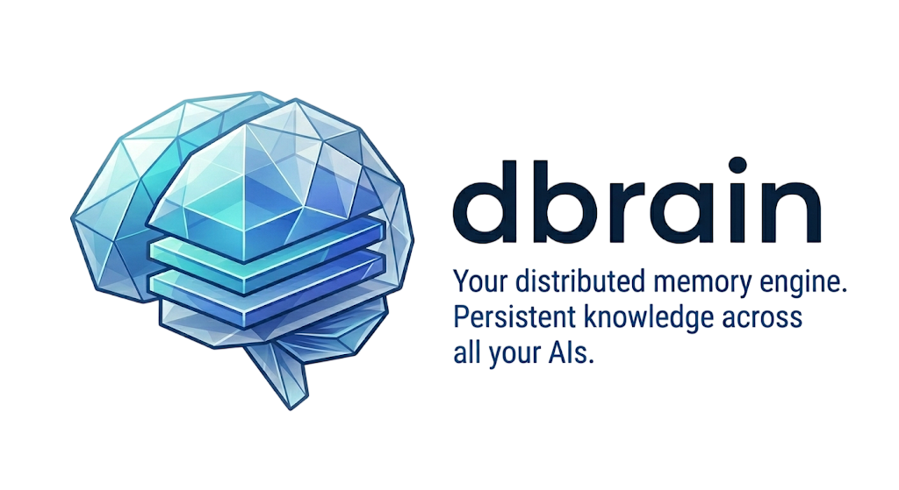
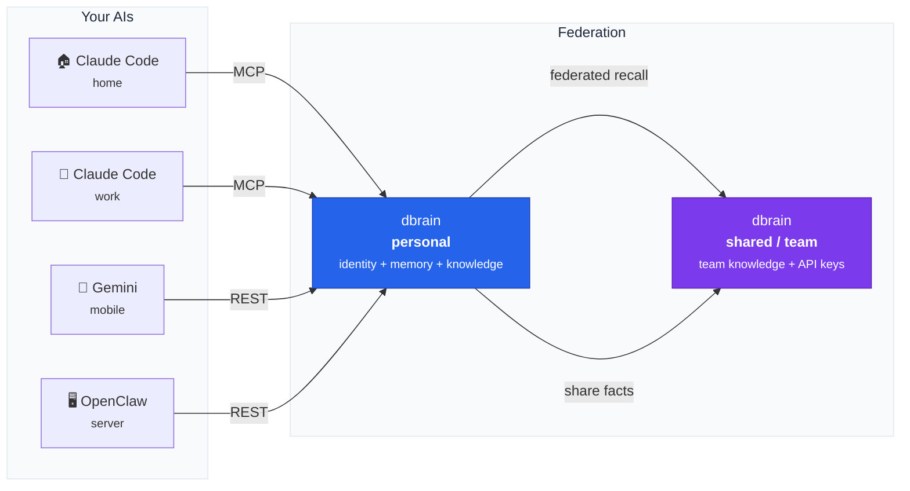

<p align="center">
  
</p>

<h1 align="center">@dtoolkit/dbrain</h1>
<p align="center">Your distributed mind. Persistent knowledge across all your AIs.</p>

<p align="center">
  <a href="https://www.npmjs.com/package/@dtoolkit/dbrain"></a>
  <a href="../../LICENSE"></a>
</p>

Install it once, connect every AI you use — Claude Code at home, Claude Code at work, Gemini on your phone. All share the same identity, the same memories, the same knowledge.



## Install

```bash
npm install -g @dtoolkit/dbrain
```

## Quick start

```bash
dbrain init       # interactive wizard — creates DB, config, identity
dbrain start      # starts API on :7878 + dashboard on :7879
```

Then connect Claude Code from any machine:

```bash
dbrain connect claude
```

## Docker

```bash
docker compose up -d
```

Then from any client machine:

```bash
dbrain connect claude http://your-server:7878
```

## How it works

The brain has 4 layers:

| Layer             | What                                                  | How                                                  |
| ----------------- | ----------------------------------------------------- | ---------------------------------------------------- |
| **Identity**      | Who is the AI? Who is the user? How should it behave? | `documents` table                                    |
| **Conversations** | Raw chat history from every AI session                | `conversations` + `messages` tables                  |
| **Knowledge**     | Structured facts organized by PARA                    | `entities` + `facts` tables with hot/warm/cold tiers |
| **Recall**        | Full-text search over all facts                       | FTS5 with OR logic for multi-language queries        |
| **Federation**    | Personal brains connect to shared team brains         | Per-user API keys, federated recall, manual fact push |

### Memory tiers

Memories fade if you don't use them — like a real brain.

| Tier     | Rule                                              |
| -------- | ------------------------------------------------- |
| **hot**  | Accessed in the last 7 days, or accessCount >= 10 |
| **warm** | 8–30 days since last access                       |
| **cold** | > 30 days — fading, candidate for archival        |

## MCP tools

| Tool            | Purpose                                     |
| --------------- | ------------------------------------------- |
| `recall`        | Search memory + get identity (primary tool) |
| `remember`      | Save a fact to an entity                    |
| `get_entity`    | Read entity with all its facts              |
| `list_entities` | List entities by category or type           |
| `create_entity` | Create a new entity                         |
| `bump`          | Touch a memory to keep it hot               |
| `log`           | Send conversation messages for storage      |
| `wake_up`       | Full identity load                          |
| `overview`      | Brain stats                                 |
| `share`         | Push a fact to a connected shared brain     |
| `compact`       | Run compaction (dedup + tier recalc)        |

## REST API

All endpoints require `Authorization: Bearer <token>` except `/health`.

| Method            | Endpoint              | Purpose                                        |
| ----------------- | --------------------- | ---------------------------------------------- |
| `GET`             | `/health`             | Brain pulse                                    |
| `GET`             | `/connect`            | Client config (MCP, permissions, instructions) |
| `GET/PUT/DELETE`  | `/workspace/:key`     | Identity documents                             |
| `GET/POST/DELETE` | `/entities/:id`       | Knowledge entities                             |
| `POST`            | `/entities/:id/facts` | Add facts to an entity                         |
| `PATCH`           | `/facts/:id/access`   | Bump a memory (keep it hot)                    |
| `GET/POST`        | `/conversations`      | Chat history                                   |
| `POST`            | `/search`             | Full-text search (supports `federated: true`)  |
| `GET`             | `/memory/summary`     | Overview: entities x tiers                     |
| `GET`             | `/connections`        | List connected brains with health status       |
| `POST/GET/DELETE` | `/keys`               | API key management (shared brains only)        |
| `PATCH`           | `/keys/:id`           | Update API key permissions                     |
| `POST`            | `/facts/:id/share`    | Push a fact to a connected brain               |
| `GET`             | `/me`                 | Current user/admin info                        |
| `POST`            | `/compact`            | Run compaction (admin-only)                    |

## CLI commands

| Command                          | Where  | Purpose                                   |
| -------------------------------- | ------ | ----------------------------------------- |
| `dbrain init [path]`             | Server | Create a new brain (DB, config, identity) |
| `dbrain start [path]`            | Server | Start the API server + dashboard          |
| `dbrain connect <client> [url]`  | Client | Connect a client to a running brain       |
| `dbrain status [path]`           | Server | Check brain status                        |
| `dbrain link <url>`              | Client | Connect to a shared brain                 |
| `dbrain unlink <name>`           | Client | Disconnect from a shared brain            |
| `dbrain connections`             | Client | List connections with health status        |
| `dbrain compact [path]`          | Server | Run compaction (dedup + tier recalc)      |
| `dbrain configure [path]`       | Server | Interactive config editor                 |
| `dbrain keys <action>`           | Server | Manage per-user API keys (shared brains)  |

## Dashboard

Web dashboard on port `7879` (API port + 1). Single-file React 18 app — CDN deps, no build step.

- Brain status with live pulse indicator and stats (entities, facts by tier, conversations).
- Entity grid with PARA category coloring and hot/warm/cold tier badges.
- Entity detail view with all facts.
- Conversation list with source, date, and click-to-view messages.
- Full-text search over all memories.
- Light / Dark themes (Cloud / Ocean).
- Mobile responsive with hamburger menu.
- Token-based auth (validated against `/memory/summary`).

## Stack

| Layer      | Technology                                 |
| ---------- | ------------------------------------------ |
| Language   | Node.js + TypeScript                       |
| API        | Fastify                                    |
| DB         | SQLite + FTS5 (better-sqlite3)             |
| MCP        | @modelcontextprotocol/sdk (HTTP transport) |
| Validation | Zod                                        |
| CLI        | @clack/prompts                             |
| Dashboard  | React 18 (CDN, no build step)              |

## Environment variables

For non-interactive setup (Docker, CI):

| Variable            | Default        | Purpose          |
| ------------------- | -------------- | ---------------- |
| `DBRAIN_DATA`       | `~/.dbrain`    | Data path        |
| `DBRAIN_PORT`       | `7878`         | API port         |
| `DBRAIN_HOST`       | `0.0.0.0`      | Bind address     |
| `DBRAIN_TOKEN`      | Auto-generated | Access token     |
| `DBRAIN_AGENT_NAME` | `dBrain`       | AI identity name |
| `DBRAIN_OWNER_NAME` | `Human`        | Owner name       |
| `DBRAIN_TIMEZONE`   | Auto-detected  | Owner timezone   |
| `DBRAIN_BRAIN_NAME` | from identity  | Brain display name  |
| `DBRAIN_BRAIN_TYPE` | `personal`     | `personal` or `shared` |

## License

[MIT](../../LICENSE)
