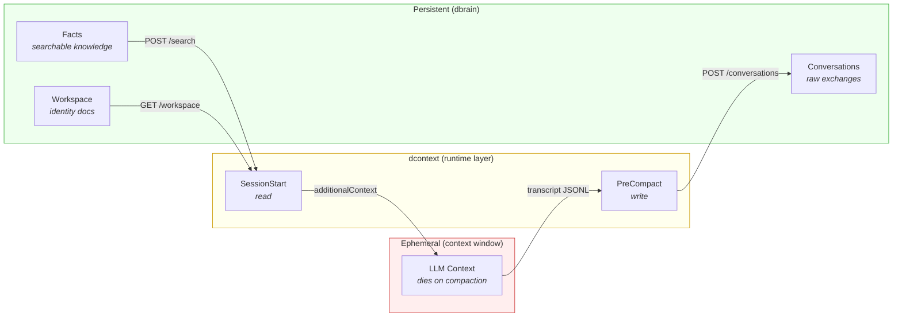
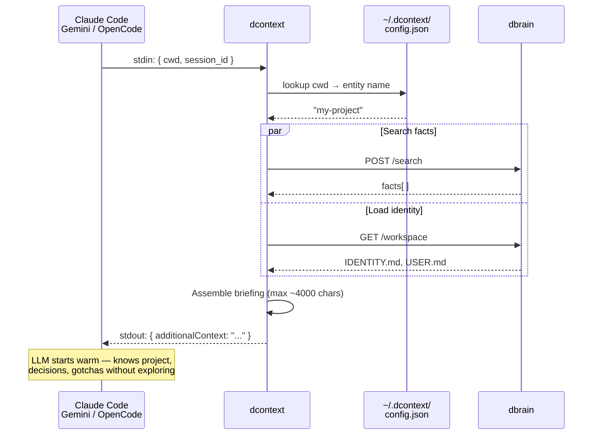
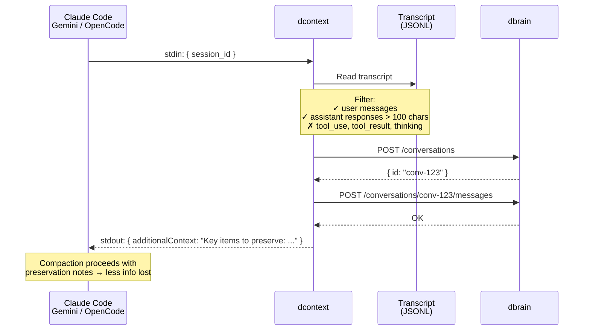

<p align="center">
  
</p>

<h1 align="center">@dtoolkit/dcontext</h1>
<p align="center">Runtime context optimizer for AI coding sessions</p>

<p align="center">
  <a href="https://www.npmjs.com/package/@dtoolkit/dcontext"></a>
  <a href="../../LICENSE"></a>
</p>

Transparent hook-based layer that makes sessions start warm and lose less on compaction. Works with **Claude Code**, **Gemini CLI**, and **OpenCode** via their native hook systems.

dcontext manages the **flow** between the context window (ephemeral) and persistent storage. It works standalone for compaction preservation, and integrates with [dbrain](../dbrain/) for cross-session knowledge.

## Works with

| Integration | Status | What it enables |
|-------------|--------|----------------|
| **Standalone** | v1 | Compaction preservation — extracts key exchanges before context is lost |
| **+ [dbrain](../dbrain/)** | v1 | Warm starts — injects project knowledge at session start; saves exchanges to dbrain |
| **Claude Code** | v1 | Hooks via plugin in `~/.claude/plugins/dcontext/` |
| **Gemini CLI** | v1 | Hooks via `~/.gemini/settings.json` |
| **OpenCode** | v1 | In-process npm plugin |
| **+ [dproxy](../dproxy/)** | planned | Context optimization for dproxy sessions |
| **+ [dprime](../dprime/)** | planned | Enhanced briefings powered by dprime's module-aware context |

## Install

```bash
npm install -g @dtoolkit/dcontext
```

## Quick start

### Standalone (no dbrain)

```bash
# 1. Init without dbrain
dcontext init --no-dbrain

# 2. Install hooks
dcontext install claude-code

# 3. Done — compaction preservation works out of the box
#    Pre-compact hook saves key exchanges locally before context is lost
```

### With dbrain (full features)

```bash
# 1. Configure dbrain connection and map your project
dcontext init

# 2. Install hooks for your CLI(s)
dcontext install claude-code
dcontext install gemini
dcontext install opencode

# 3. Start coding — sessions start warm, compaction is less lossy
claude   # session starts warm with project briefing from dbrain
gemini   # same briefing, same knowledge
```

## How it works

dcontext hooks into two moments of a session's lifecycle:

| Moment | What happens | Requires dbrain? |
|--------|-------------|-----------------|
| **Session start** | Injects a project briefing — recent decisions, milestones, gotchas | Yes |
| **Pre-compaction** | Extracts key exchanges from the transcript before context is lost | No (standalone saves locally; with dbrain, saves to dbrain) |

The LLM never knows dcontext exists. It receives the briefing as system context and the preservation notes as additional context.



### Session start — warm briefing

When a session begins, dcontext searches dbrain for project-relevant knowledge and injects it as context:



### Pre-compaction — knowledge extraction

When the CLI is about to compact context (~90% full), dcontext reads the session transcript, extracts meaningful exchanges, and saves them to dbrain:



## Supported CLIs

| CLI | Hook mechanism | Install location | Hooks used |
|-----|---------------|-----------------|------------|
| **Claude Code** | Shell plugin (JSON stdin/stdout) | `~/.claude/plugins/dcontext/` | `SessionStart`, `PreCompact` |
| **Gemini CLI** | Shell hooks (JSON stdin/stdout) | `~/.gemini/settings.json` | `SessionStart`, `PreCompress` |
| **OpenCode** | npm plugin (in-process) | `~/.config/opencode/node_modules/` | `experimental.chat.system.transform`, `experimental.session.compacting` |

**Not supported**: Codex (only has `PostToolUse` hook — no session start or compaction hooks), Ollama (no hook system).

## Commands

### `dcontext init`

Interactive setup wizard:

```bash
# With dbrain
dcontext init
# ? dbrain URL: http://localhost:7878
# ? dbrain token: ****
# ✓ Connected to dbrain (3 entities, 42 facts)
# ? Map /Users/ivan/my-project to entity: my-project
# ✓ Config saved to ~/.dcontext/config.json

# Without dbrain (extraction-only mode)
dcontext init --no-dbrain
# ✓ Config saved to ~/.dcontext/config.json (standalone mode)
```

### `dcontext install <target>`

Install hooks for a target CLI:

```bash
dcontext install claude-code    # creates ~/.claude/plugins/dcontext/
dcontext install gemini         # merges hooks into ~/.gemini/settings.json
dcontext install opencode       # registers npm plugin
```

### `dcontext uninstall <target>`

Remove hooks cleanly:

```bash
dcontext uninstall claude-code  # removes ~/.claude/plugins/dcontext/
dcontext uninstall gemini       # removes dcontext hooks from settings.json
dcontext uninstall opencode     # unregisters plugin
```

### `dcontext status`

Show configuration, installed targets, and stats:

```bash
dcontext status
# dbrain: http://localhost:7878 (connected, 3 entities)
# targets:
#   claude-code: installed (since 2026-05-13)
#   gemini: not installed
#   opencode: not installed
# projects:
#   /Users/ivan/my-project → my-project
# stats:
#   briefings: 42 (last: 2 hours ago)
#   extractions: 7 (89 exchanges saved)
```

### `dcontext hook <event>`

Internal command called by hook scripts. Not meant for direct use.

```bash
# Called automatically by Claude Code/Gemini/OpenCode hooks:
echo '{"cwd":"/path/to/project","session_id":"abc"}' | dcontext hook session-start
echo '{"session_id":"abc"}' | dcontext hook pre-compact
```

Always exits 0 — a broken hook should never block the user's session. Errors are logged to `~/.dcontext/error.log`.

## Configuration

Config lives at `~/.dcontext/config.json`:

```json
{
  "dbrain": {
    "url": "http://localhost:7878",
    "token": "your-token"
  },
  "projects": {
    "/Users/ivan/my-project": "my-project",
    "/Users/ivan/other-project": "other-project"
  },
  "briefing": {
    "maxFacts": 15,
    "includeIdentity": true,
    "maxChars": 4000
  },
  "extraction": {
    "maxExchanges": 20,
    "minAssistantLength": 100
  }
}
```

Without dbrain, the config omits the `dbrain` and `projects` sections:

```json
{
  "extraction": {
    "maxExchanges": 20,
    "minAssistantLength": 100
  }
}
```

| Key | Default | Description |
|-----|---------|-------------|
| `dbrain.url` | `http://localhost:7878` | dbrain server URL |
| `dbrain.token` | — | Bearer token for dbrain API |
| `projects` | `{}` | Maps absolute cwd path to dbrain entity name |
| `briefing.maxFacts` | `15` | Max facts to include in briefing |
| `briefing.includeIdentity` | `true` | Include IDENTITY.md and USER.md in briefing |
| `briefing.maxChars` | `4000` | Max briefing length in characters |
| `extraction.maxExchanges` | `20` | Max exchanges to extract per compaction |
| `extraction.minAssistantLength` | `100` | Min assistant message length to keep |

## dbrain integration (optional)

When connected to [dbrain](../dbrain/), dcontext unlocks warm starts and persistent cross-session knowledge. Without dbrain, pre-compaction extraction still works locally.

Communication uses [`@dtoolkit/sdk`](../sdk/) (`DBrainClient`). No new dbrain endpoints are needed.

| Operation | SDK method | Endpoint | Used in |
|-----------|-----------|----------|---------|
| Search project facts | `client.search(query)` | `POST /search` | SessionStart |
| Load identity docs | `client.listDocuments()` | `GET /workspace` | SessionStart |
| Create conversation | `client.startConversation(source)` | `POST /conversations` | PreCompact |
| Save exchanges | `client.sendMessages(id, msgs)` | `POST /conversations/:id/messages` | PreCompact |
| Verify connection | `client.health()` | `GET /health` | init, status |
| List entities | `client.listEntities()` | `GET /entities` | init |

## Planned integrations

**[dproxy](../dproxy/)** — dcontext will optimize context for dproxy sessions, applying the same warm-start and compaction-preservation logic when using `dproxy chat` or `dproxy ask`.

**[dprime](../dprime/)** — dprime generates module-aware briefings (`dprime ./src/billing`). When both are active, dcontext can use dprime's output as part of the session briefing, combining project-level knowledge (from dbrain) with module-level context (from dprime).

## Data storage

```
~/.dcontext/
├── config.json     # Main configuration (created by `dcontext init`)
├── stats.json      # Usage statistics (briefings served, extractions done)
└── error.log       # Hook errors (hooks never crash, they log and exit 0)
```

## License

[MIT](../../LICENSE)
